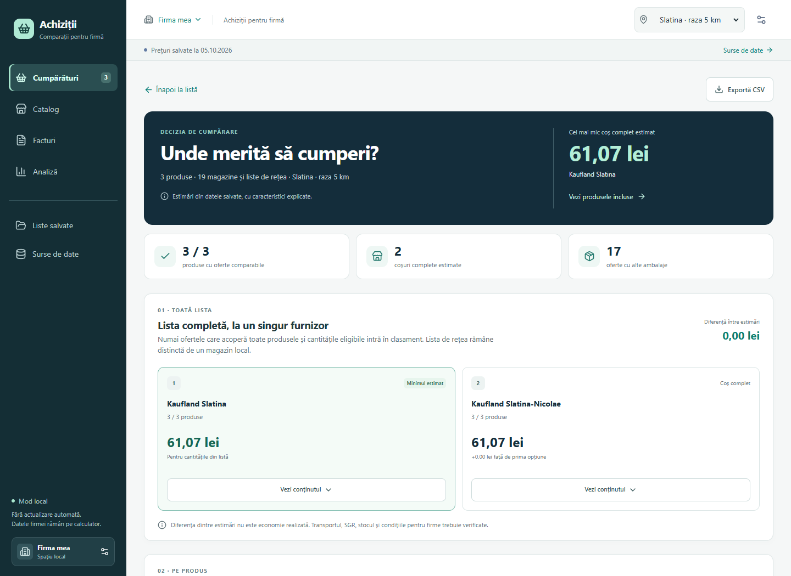

# Aplicație Ionuț - achiziții inteligente pentru firme


**Preluare de către un coleg sau alt agent AI:** începe cu [AGENTS.md](AGENTS.md) și [ghidul de handover](docs/HANDOVER.md). Ghidul descrie starea reală, comenzile existente, baseline-ul, următoarea etapă E1b și un prompt de început. Nu este necesar istoricul chatului pentru continuarea locală.

Aplicație locală pentru explorarea catalogului, liste de cumpărături persistente și comparații explicabile din probele salvate. Etapele E0 + E1a din [planul complet](docs/PLAN_IMPLEMENTARE.md) sunt implementate. [Revizia interfeței și motorului](docs/IMPLEMENTARE_COMPARATII.md) adaugă prețuri direct în catalog și liste, comparații pe caracteristici și estimări pentru coșuri complete. [Auditul comparațiilor](docs/REVIZIE_COMPARATII.md) documentează regulile pe probe reale; [raportul primei livrări](docs/IMPLEMENTARE_E1.md) păstrează verificările versiunii inițiale.

**Revizia din 7 octombrie:** [interfață și corelare îmbunătățite](docs/REVIZIE_UX_CORELARE.md), schimbarea produselor din listă, alternative de ambalaj cu preț/kg/l, conținutul coșurilor și export CSV explicabil.

Planul include [specificația produsului](docs/SPECIFICATIE_PRODUS.md), [motorul de corectitudine](docs/MOTOR_CORECTITUDINE.md), [arhitectura](docs/DECIZII_ARHITECTURA.md) și [investigația Compari.ro](docs/CERCETARE_COMPARI.md). [Cererea inițială](CERERE_INITIALA.md), [cerințele extinse](docs/CERINTE_EXTINSE.md) și [raportul probelor](RAPORT_TESTARE.md) păstrează contextul.

## Starea proiectului

| Disponibil în cod | Planificat, încă neimplementat |
|---|---|
| Catalog, prețuri salvate și filtre | Colectare continuă și extinderea surselor |
| Liste persistente, cantități și schimbarea produsului ales | Import facturi, PDF și OCR |
| Corelare pe caracteristici, utilizare și ambalaj; alternative cu preț/kg/l | Achiziții confirmate și evaluarea furnizorilor |
| Coșuri complete detaliate, comparații și export CSV | Login, conturi și acces pentru mai multe firme |
| Mod local, sesiune și protecție CSRF | Emailuri de cont, invitații, alerte și notificări |

Planul complet include [conturile și emailurile](docs/ACCES_SI_EMAIL.md): verificarea adresei, recuperarea accesului, onboarding, invitații, roluri, sesiuni, MFA, emailuri tranzacționale, preferințe și livrare fiabilă. Autentificarea și izolarea între firme sunt condiții ale lansării online din E4. Implementarea locală actuală nu cere un cont și nu trimite emailuri.



## Pornire locală

Scripturile incluse sunt pentru Windows, cu PowerShell 7, Python 3.12+ și Node.js 22.12+ (22.18 verificat). Pentru o copie nouă:

```powershell
git clone https://github.com/cosmintrica/aplicatie-ionut.git
Set-Location aplicatie-ionut
```

Apoi, din directorul proiectului:

```powershell
.\scripts\Setup-Local.ps1
.\scripts\Start-Local.ps1
```

Deschide <http://127.0.0.1:8000>. Setup instalează dependențele în proiect, construiește interfața și importă probele existente. Poți indica executabilele cu `-PythonPath` și `-NodePath`. Serverul ascultă numai pe calculatorul local; modelul de securitate nu este pregătit pentru găzduire publică sau mai multe firme.

Datele aplicației sunt în `var`, separat de snapshoturile originale. Repetarea importului trebuie să păstreze listele și să nu dubleze observațiile. Aplicația nu accesează furnizorii la pornire și nu actualizează automat prețurile.

## Ce înseamnă rezultatele

Catalogul pornește cu filtrul „Cu preț”, aplicat înainte de paginare. Poți căuta și în toate înregistrările. Prețul minim, intervalul și numărul ofertelor sunt vizibile direct. Valorile din catalog sunt prețuri raportate; comparația verifică separat dacă varianta și baza prețului corespund.

Motorul extrage marca, tipul produsului, gramajul, multipack-ul, procentul de grăsime, forma, varianta și utilizarea atunci când sunt declarate. Produsele de curățenie pentru vase, WC și țevi sunt separate; forma cafelei și tratamentul laptelui cer verificare când referința este incompletă. „Aceleași caracteristici” indică o corespondență între atributele disponibile. Variantele diferite și detaliile lipsă apar separat, cu motive. Diferențele între prețuri folosesc baze compatibile; estimările pentru cantitate folosesc numai prețurile cu bază explicită sau echivalentă pentru ambalajul de 1 l.

Alternativele cu alt ambalaj sunt prezentate separat, cu preț/kg sau litru numai când baza este explicită. Alegerea lor nu este automată. Cerința inițială rămâne vizibilă alături de produsul efectiv ales; CSV-ul include acest context, sursa și data.

Clasamentul coșurilor estimate cuprinde doar magazinele care acoperă întreaga listă. Un magazin cu poziții lipsă nu primește un total comparabil. Estimările nu includ condiții comerciale, stoc sau costuri suplimentare neverificate; diferența între oferte nu reprezintă economie deja realizată. [Contractul motorului](backend/SMART_CONTRACT.md) descrie câmpurile API și compatibilitatea cu prima versiune.

Scenariile importate sunt Slatina - 5 km și București - 1 km. Lista națională Lidl este o sursă separată; nu este asociată automat cu magazinele și codurile Monitorului. Taxonomia include de la început domenii precum alimente, curățenie, consumabile și electronice, inclusiv când nu avem oferte pentru ele. Categoriile și asocierile deduse rămân sugestii.

Facturile, confirmarea achizițiilor, OCR-ul, recomandările de furnizori și extinderea surselor sunt etape ulterioare ale planului. Prima versiune nu simulează aceste funcții și nu declară economii realizate.

## Verificări

```powershell
.\scripts\Check-Local.ps1
```

Acest script verifică parserul Monitorului, regresiile aplicației și buildul interfeței. Revizia din 7 octombrie a trecut 112 teste Python, 32 verificări PowerShell și buildul TypeScript/Vite. [Raportul reviziei](docs/REVIZIE_UX_CORELARE.md) descrie și verificările browser la 320/390 px. Pentru probele originale, fără instalarea aplicației:

```powershell
.\scripts\Test-MonitorPrices.ps1 -Offline
.\tests\Test-MonitorPricesParser.ps1
```

`probe-data` păstrează snapshoturile XML/JSON și fișierul oficial Lidl din 5 octombrie 2026. `scripts/probe-lidl.py` citește offline XLSB-ul salvat, folosind numai biblioteca standard Python; nu este un cititor Excel general.

`Test-MonitorPrices.ps1` rescrie `summary.json` inclusiv cu `-Offline`; pentru explorarea probelor, rulează-l într-o copie temporară pregătită conform [procedurii de publicare](docs/PUBLICARE.md). Fără `-Offline`, face și șase cereri publice către Monitorul Prețurilor și înlocuiește snapshoturile. Aceste operații sunt separate de importul aplicației; manifestul de integritate trebuie actualizat înainte de folosirea probelor modificate. Verificarea `Test-MonitorPricesParser.ps1` folosește numai fixture-uri temporare.

## Ce conține repository-ul public

Sunt incluse sursele backend și frontend, lockurile dependențelor, testele, configurarea categoriilor, probele publice necesare importului, documentația și planul complet. GitHub Actions rulează setupul, verificările și buildul pe Windows.

Baza de date a firmei, listele locale, fișierele private, dependențele instalate și fișierele temporare sunt excluse. Copia de publicare înlocuiește căile absolute locale din două fișiere JSON cu căi relative; prețurile și înregistrările comerciale sunt păstrate. [Procedura de publicare](docs/PUBLICARE.md) explică manifestul și păstrarea probelor originale.
