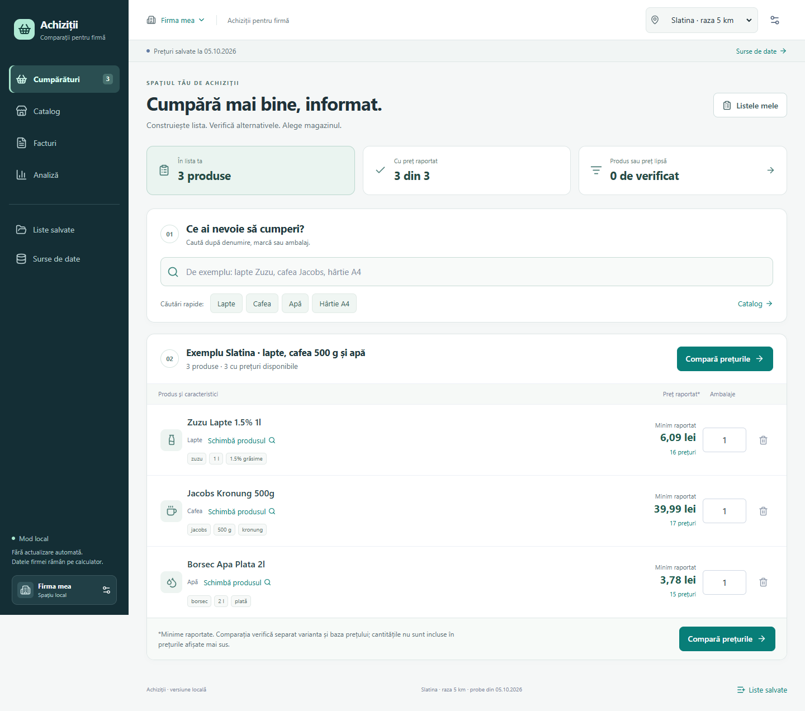
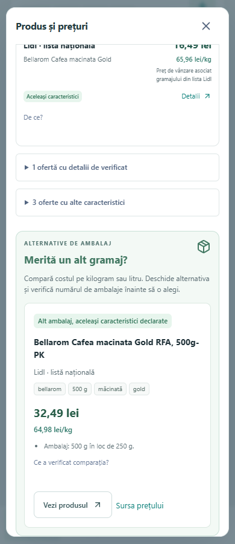

# Revizie interfață și corelare - 7 octombrie 2026

Această revizie continuă aplicația locală existentă la cererea utilizatorului. Prioritatea a fost utilizarea zilnică a listei și corectitudinea alternativelor. Nu schimbă sursele, probele, schema SQLite sau limitele de lansare online.

## Interfață și funcții

- Navigare navy/verde, contrast și ierarhie mai clare, sumar al listei și filtru pentru poziții fără produs ales sau fără preț raportat.
- Catalog cu acces rapid la categorii, resetarea filtrelor și caracteristici vizibile: marcă, ambalaj, variantă, formă și utilizare, atunci când există în sursă. Pe telefon, categoriile se derulează orizontal.
- Schimbarea produsului unei poziții păstrează cerința inițială. Comparația și exportul arată separat produsul ales efectiv, pentru a evita afișarea unui ambalaj vechi lângă prețul celui nou.
- Cantitățile modificate trebuie salvate înainte de comparație. Cererile întârziate pentru comparații și produse sunt anulate la schimbarea contextului.
- Comparația începe cu cel mai mic coș complet estimat și permite deschiderea conținutului fiecărui coș. Totalurile pe linie vin din backend.
- Matricea separă eligibilitatea pentru cantitatea cerută de existența unui preț raportat. Lista națională Lidl rămâne distinctă de magazinele geografice.
- Export CSV la cererea utilizatorului: produs cerut și ales, cantitate, preț, bază, motiv, sursă și dată. Valorile care pot fi interpretate ca formule sunt neutralizate.

## Corelare și alternative

Datele reale au evidențiat false asocieri între W5 pentru vase/WC/țevi, între variante Bellarom și între ciocolată caldă și cafea. Motorul separă utilizarea produsului, varianta și forma; tratează explicit lipsa unor caracteristici esențiale. Mărcile și unitățile lipite sunt extrase prin reguli explicabile, fără similitudine fuzzy care să confirme identitatea.

Ambalajele de tip `100 g x 3` păstrează numărul de bucăți. Alternativele cu alt gramaj sunt separate de ofertele pentru produsul cerut. Alegerea lor necesită o acțiune explicită și verificarea numărului de ambalaje.

Prețul pe kilogram/litru este calculat cu `Decimal` numai când baza este explicită. Un preț declarat `per kg` poate fi afișat pe kilogram, dar nu devine automat prețul unei bucăți. Unitatea ambiguă `K`/`Kg` nu autorizează acest calcul. API-ul păstrează valoarea zecimală și eticheta rotunjită pentru afișare.

Noile câmpuri sunt aditive și sunt documentate în [contractul motorului](../backend/SMART_CONTRACT.md). O corespondență pe atribute rămâne candidat comercial, fără confirmare GTIN. Diferențele între estimări nu sunt economii realizate.

## Verificare

Livrare publicată în [commitul 4ad818b](https://github.com/cosmintrica/aplicatie-ionut/commit/4ad818b49059bf8a914e56f9442c4bec0c25bf93). [GitHub Actions](https://github.com/cosmintrica/aplicatie-ionut/actions/runs/37555766904) a încheiat cu succes instalarea, importul probelor și verificările pe clonă curată. Rezultatele de mai jos aparțin acestei revizii de cod.

`scripts/Check-Local.ps1`: 112 teste Python trecute (37 regresii noi), 32 verificări PowerShell trecute și build TypeScript/Vite reușit. Avertismentul Starlette/TestClient privind httpx este preexistent. Prima execuție a întâlnit permisiuni incompatibile pe directorul temporar pytest Windows; rerularea cu `PYTEST_ADDOPTS` către directoare noi din `tmp` a trecut integral. Nu s-au modificat permisiunile globale sau comportamentul aplicației pentru a rezolva acest impediment local.

Browser: Chromium cu Playwright din runtime-ul agentului, pe loopback. Instrumentul browser integrat nu a reușit inițializarea; verificările au folosit un browser separat. Playwright nu a fost adăugat în dependențele aplicației. Baza izolată prin `APP_DB_PATH` conține liste de test și date publice, fără modificarea listelor firmei din `var/app.sqlite3`.

Verificate efectiv:

- Cantitate nesalvată blochează comparația; cantitatea salvată persistă după reload.
- Navigarea anulează comparația întârziată; o cerere veche de produs nu înlocuiește un rezultat nou ales și nu redeschide dialogul după începerea altei asocieri.
- Catalog, listă, comparație și dialog de alternative la 320/390 px, fără overflow orizontal al paginii. Matricea se derulează separat.
- Detaliile unui coș complet conțin trei totaluri de linie furnizate de backend; focusul ajunge la titlul conținutului.
- Cantitatea `0.5` de ambalaje nu produce celule eligibile sau coș complet.
- Bellarom Gold 250/500 g: 65,96/64,98 lei/kg în interfață, fără includerea variantelor incompatibile în alternative.
- Înlocuirea 250 g cu 500 g păstrează o singură linie și cerința inițială; matricea, profilul și CSV-ul folosesc produsul nou. Oferta națională Lidl este eligibilă numai în propriul context.
- CSV descărcat cu proveniență, bază și contextul produsului ales; funcțiile de export au fost verificate și pe intrări care ar putea declanșa formule.
- Dovada păstrează referința aleasă; tasta Escape închide dialogul. Nicio eroare JavaScript în parcursurile testate.

După testare, aplicația a fost repornită pe baza implicită. Amprenta datelor din `company`, `shopping_list` și `list_line` a rămas identică înainte și după repornire. Datele firmei și bazele de test nu au fost publicate.

## Ce urmează

Următoarea etapă de produs rămâne E1b: achiziții confirmate, apoi importurile și OCR-ul conform [planului](PLAN_IMPLEMENTARE.md). Această revizie nu activează login, emailuri, colectare live sau recomandări de furnizori bazate pe istoric.
